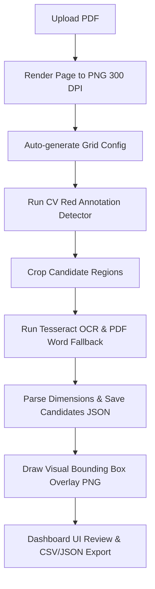

# PlanFuge (Fork)

This repository is a fork of [beyzabetulay/planfuge](https://github.com/beyzabetulay/planfuge) containing enhancements, test suites, and CI/CD pipelines developed on top of the original prototype built for the **Riedel Bau Hackathon Challenge**.

PlanFuge supports the extraction, review, and export of ceiling recesses and slab opening candidates from construction plans for concrete 3D printing preparation. It uses a **human-in-the-loop (HITL)** approach: extracting candidate opening coordinates via computer vision and OCR, rendering evidence overlays to a reviewer, and exporting verified datasets.

---

## Fork Improvements & Contributions

The following features and quality-of-life enhancements were implemented in this fork:

* **Visual Bounding Box Overlay Pipeline:** Implemented [overlay_drawer.py](file:///home/yusufkaratas/Documents/planfuge/planfuge/src/candidates/overlay_drawer.py) to dynamically draw status-coded bounding box rectangles (Blue for `verified`, Red for `needs_review`) and candidate ID labels directly on blueprint drawings with proportional line width scaling and system fallback fonts.
* **Pipeline Integration & Clean Teardown:** Integrated the overlay drawing step into [run_pipeline_on_pdfs.py](file:///home/yusufkaratas/Documents/planfuge/planfuge/scripts/run_pipeline_on_pdfs.py) to trigger automatically post-extraction, with fail-safe deletion of partial images on failure.
* **Comprehensive Test Suites:** Added new unit tests (`tests/test_overlay_drawer.py`) and FastAPI endpoints/integration tests (`server/tests/test_api.py`) to verify the pipeline state and image loading, with all 120+ tests passing.
* **Onboarding & Clean Slate Setup:** Cleared all tracked sample PDF/PNG outputs from Git, redesigned the empty-state frontend dashboard into a user onboarding UI, and updated `.gitignore` rules for production standards.
* **CI/CD Integration:** Set up a [ci.yml](file:///home/yusufkaratas/Documents/planfuge/planfuge/.github/workflows/ci.yml) pipeline using GitHub Actions to automatically run backend unit tests, frontend linters, and frontend build validations.

---

## Technology Stack

* **Frontend:** React, Vite, TypeScript, Tailwind CSS, Lucide Icons
* **Backend:** FastAPI (Python), Uvicorn, Pydantic, HTTPX
* **PDF Processing:** PyMuPDF (fitz)
* **Computer Vision:** Pillow (PIL) and NumPy
* **OCR engine:** Tesseract OCR (via `pytesseract`)
* **Data Processing:** pandas
* **Testing:** Python `unittest` framework, FastAPI TestClient

---

## Repository Structure

```text
.github/workflows/   GitHub Actions CI/CD workflows
client/              React + Vite frontend dashboard
docker/              Dockerfiles for multi-stage builds
docs/                Product requirements (PRD) and internal architectural documents
server/              FastAPI backend source code and test suite
src/                 Core computer vision, OCR extraction, and parser modules
scripts/             Extraction pipeline execution and utility scripts
data/                Ignored inputs (imports, rendered pages, config files)
outputs/             Ignored outputs (candidate JSONs, crops, overlays, exports)
tests/               Python unit and integration tests for CV and pipeline logic
```

---

## Pipeline Data Flow



1. **PDF Import:** PDFs uploaded to `/api/import/pdf` are stored in `data/imports/`.
2. **Page Rendering:** PyMuPDF renders the first page of the PDF into a 300 DPI high-resolution PNG in `outputs/rendered/`.
3. **Auto-Configuration:** Analyzes grid coordinates and scale text to populate the plan metadata config in `data/config/`.
4. **Computer Vision & OCR:** Extracts coordinates from red-highlighted areas on the drawing, crops those areas, and extracts bounding-box text using Tesseract OCR.
5. **Pillow Overlay Drawer:** Reads the candidate list, scales the stroke line thickness proportionally to the dimensions, draws hollow status-colored rectangles (Red/Blue), writes text labels, and saves the final PNG to `outputs/overlays/`.
6. **Dashboard Interaction:** Serves the overlay at `/api/images/overlays/{plan_id}` when the reviewer checks "Show Overlay", enabling cross-referencing between bounding box markers and tabular calculations.

---

## Setup & Execution

### 1. Docker Compose (Recommended)

Docker Compose handles Python, Node, Nginx, and Tesseract dependencies automatically. From the repository root, run:

```bash
docker compose up --build -d
```

Open your browser to:
```text
http://localhost:8080
```

Verify that the local containers are healthy and reachable using the integration smoke test:
```bash
python3 scripts/docker_smoke_test.py
```

### 2. Manual Local Development

If you prefer to run the components locally without Docker:

#### System Dependency (Tesseract OCR)
Install the Tesseract binary and language packs (English & German):
```bash
# Debian/Ubuntu
sudo apt-get update && sudo apt-get install -y tesseract-ocr tesseract-ocr-deu tesseract-ocr-eng

# Fedora
sudo dnf install tesseract tesseract-langpack-deu tesseract-langpack-eng
```

#### Backend Setup
```bash
# Initialize virtual env
python3 -m venv .venv
source .venv/bin/activate
pip install -r requirements.txt

# Start FastAPI server
uvicorn server.app.api:app --host 127.0.0.1 --port 8000 --reload
```

#### Frontend Setup
```bash
cd client
npm install
npm run dev
```
Open [http://localhost:5173](http://localhost:5173). The Vite dev server will proxy API calls to the FastAPI backend at `http://127.0.0.1:8000`.

---

## Testing

### Python Tests (Backend & Pipeline)
Run all 120+ backend unit and integration tests from the project root:
```bash
python3 -m unittest discover -s server/tests
python3 -m unittest discover -s tests
```

### Frontend Tests (React)
Run frontend unit and lint checks:
```bash
cd client
npm run lint
npm run test
```
