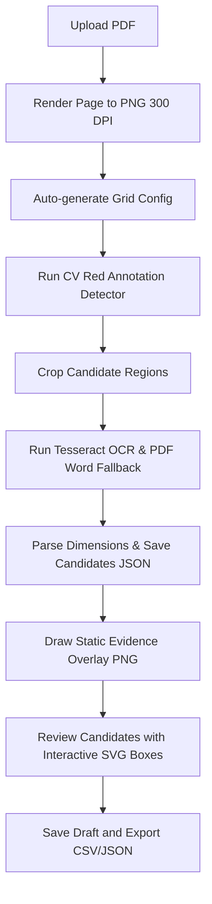

# PlanFuge

This repository is a fork of [beyzabetulay/planfuge](https://github.com/beyzabetulay/planfuge) containing enhancements, test suites, and CI/CD pipelines developed on top of the original prototype built for the **Riedel Bau Hackathon Challenge**.

PlanFuge supports the extraction, review, and export of ceiling recesses and slab opening candidates from construction plans for concrete 3D printing preparation. It uses a **human-in-the-loop (HITL)** approach: extracting candidate opening coordinates via computer vision and OCR, rendering evidence overlays to a reviewer, and exporting verified datasets.

---

## Key Capabilities

The current application includes:

- **PDF-to-candidate pipeline:** Upload a construction plan, render its first page, detect annotated regions, run OCR, parse opening dimensions, and create review candidates.
- **Interactive candidate bounding boxes:** Review candidates directly on the original plan through a responsive SVG layer. Hover or focus a box to see its ID and status, click it to select the matching table row, or click a row to pulse its plan location. Interactive colors are green for `verified`, red for `needs_review`, and yellow for other states.
- **Generated evidence overlay:** [overlay_drawer.py](src/candidates/overlay_drawer.py) produces a static status-coded PNG after extraction. [run_pipeline_on_pdfs.py](scripts/run_pipeline_on_pdfs.py) integrates this step and removes partial output after a failure.
- **Human-in-the-loop review:** Edit extracted values and statuses, inspect candidate crops, save review drafts, and export CSV or JSON contract data.
- **Dark mode:** Switch between light and dark themes from the header. The preference is persisted in `localStorage` and defaults to the operating-system preference on first use.
- **Onboarding & Clean Slate Setup:** Cleared all tracked sample PDF/PNG outputs from Git, redesigned the empty-state frontend dashboard into a user onboarding UI, and updated `.gitignore` rules for production standards.
- **Automated quality gates:** [ci.yml](.github/workflows/ci.yml) runs Python tests, frontend tests, linting, type checking, and the production build for pull requests targeting `master`.
- **Draft releases:** [release.yml](.github/workflows/release.yml) validates `v*` tags, packages the frontend build, and creates a GitHub draft release with generated notes.
- **Pre-commit hooks:** `.pre-commit-config.yaml` runs Black, Ruff, Prettier, ESLint, and TypeScript checks before each commit.

---

## Development Prerequisites

- Python 3.11 or newer
- Node.js 22 and npm
- Tesseract OCR with English and German language data
- Docker with Compose support for the recommended container workflow

## Pre-Commit Setup

After installing the backend and frontend dependencies, install the pre-commit hooks once:

```bash
pip install pre-commit
pre-commit install
```

From that point on, every `git commit` will automatically run:

| Hook           | What it checks                                          |
| -------------- | ------------------------------------------------------- |
| `black`        | Python formatting (auto-fixes)                          |
| `ruff`         | Python linting & unused imports (auto-fixes)            |
| `prettier`     | TypeScript/JS/CSS/JSON/Markdown formatting (auto-fixes) |
| `eslint`       | TypeScript/React lint rules                             |
| `tsc --noEmit` | TypeScript type checking                                |

To run all hooks manually on the full codebase:

```bash
pre-commit run --all-files
```

---

## Technology Stack

- **Frontend:** React, Vite, TypeScript, Tailwind CSS, Lucide Icons
- **Backend:** FastAPI (Python), Uvicorn, Pydantic, HTTPX
- **PDF Processing:** PyMuPDF (fitz)
- **Computer Vision:** Pillow (PIL) and NumPy
- **OCR engine:** Tesseract OCR (via `pytesseract`)
- **Data Processing:** pandas
- **Testing:** Python `unittest` framework, FastAPI TestClient

---

## Repository Structure

```text
.github/workflows/   GitHub Actions CI/CD workflows
client/              React + Vite frontend dashboard
docker/              Dockerfiles for multi-stage builds
docs/                Product requirements (PRD) and internal architectural documents
server/              FastAPI backend source code and test suite
src/                 Core computer vision, OCR extraction, and parser modules
scripts/             Extraction pipeline execution and utility scripts
data/                Ignored inputs (imports, rendered pages, config files)
outputs/             Ignored outputs (candidate JSONs, crops, overlays, exports)
tests/               Python unit and integration tests for CV and pipeline logic
```

---

## Pipeline Data Flow



1. **PDF Import:** PDFs uploaded to `/api/import/pdf` are stored in `data/imports/`.
2. **Page Rendering:** PyMuPDF renders the first page of the PDF into a 300 DPI high-resolution PNG in `outputs/rendered/`.
3. **Auto-Configuration:** Analyzes grid coordinates and scale text to populate the plan metadata config in `data/config/`.
4. **Computer Vision & OCR:** Extracts coordinates from red-highlighted areas on the drawing, crops those areas, and extracts bounding-box text using Tesseract OCR.
5. **Static Evidence Overlay:** Reads the candidate list, draws proportional red/blue rectangles and candidate labels, and saves the generated PNG to `outputs/overlays/`.
6. **Interactive Review:** Renders candidate geometry as an SVG layer over the original image. Plan-box and table-row selection stay synchronized, while the Original/Overlay switch provides access to the generated evidence image.
7. **Draft and Export:** Saves reviewer edits and produces downloadable CSV or JSON contract data.

---

## Setup & Execution

### 1. Docker Compose (Recommended)

Docker Compose handles Python, Node, Nginx, and Tesseract dependencies automatically. From the repository root, run:

```bash
docker compose up --build -d
```

Docker runtime storage is intentionally ephemeral. Every backend container start clears
its internal `data/` and `outputs/` directories before serving requests. Uploaded PDFs,
review drafts, crops, overlays, and exports remain available during the current container
session only; restarting or recreating the backend starts again with an empty plan list.
Host-side `data/` and `outputs/` files are not mounted into the container.

Open your browser to:

```text
http://localhost:8080
```

Immediately after a fresh start, verify that the containers are healthy, reachable, and
contain no preloaded plans:

```bash
python3 scripts/docker_smoke_test.py
```

### 2. Manual Local Development

If you prefer to run the components locally without Docker, the backend uses the repository's
host-side `data/` and `outputs/` directories. The automatic session reset applies only to the
Docker workflow.

#### System Dependency (Tesseract OCR)

Install the Tesseract binary and language packs (English & German):

```bash
# Debian/Ubuntu
sudo apt-get update && sudo apt-get install -y tesseract-ocr tesseract-ocr-deu tesseract-ocr-eng

# Fedora
sudo dnf install tesseract tesseract-langpack-deu tesseract-langpack-eng
```

#### Backend Setup

```bash
# Initialize virtual env
python3 -m venv .venv
source .venv/bin/activate
pip install -r requirements.txt

# Start FastAPI server
uvicorn server.app.api:app --host 127.0.0.1 --port 8000 --reload
```

#### Frontend Setup

```bash
cd client
npm ci
npm run dev
```

Open [http://localhost:5173](http://localhost:5173). The Vite dev server will proxy API calls to the FastAPI backend at `http://127.0.0.1:8000`.

---

## Testing

### Python Tests (Backend & Pipeline)

Run the backend and pipeline test suites from the project root:

```bash
python3 -m unittest discover -s server/tests
python3 -m unittest discover -s tests
```

### Frontend Checks

Run frontend tests, linting, type checking, and the production build:

```bash
cd client
npm run test
npm run lint
npm run build
```

Run the same pre-commit quality gates used by CI:

```bash
pre-commit run --all-files
```
